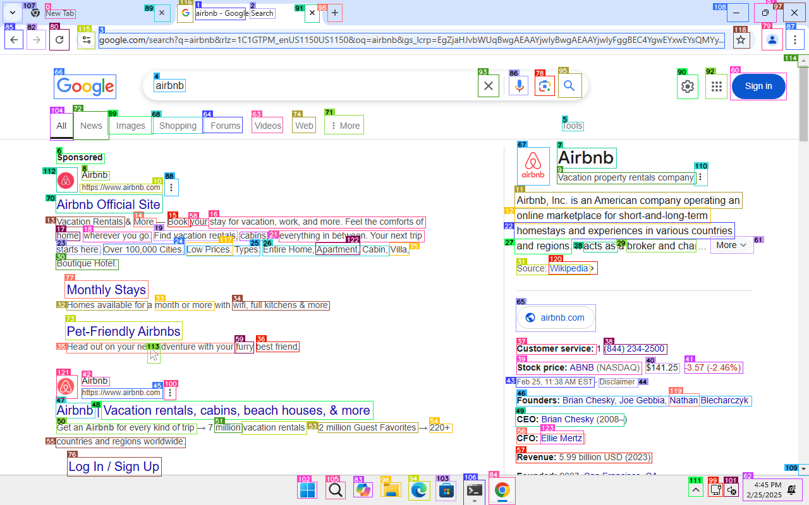
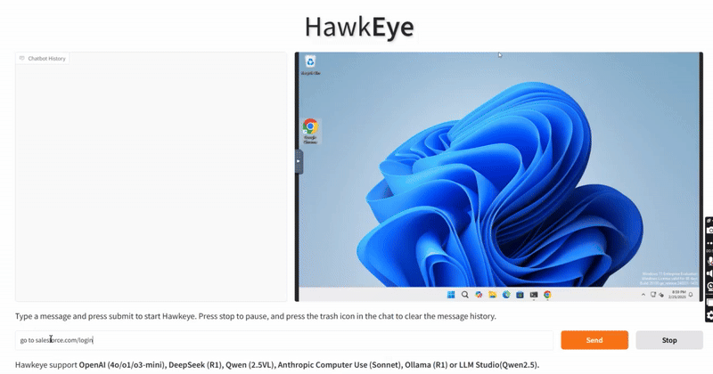

# **Project Hawkeye**  
**AI-Powered Visual Verification QA Automation**  

---

## **Overview**  
**Project Hawkeye** is an advanced AI-powered agent designed to revolutionize visual and accessibility testing for web and desktop applications. Built as a heavily modified version of **OmniTool**, it integrates cutting-edge technologies such as **OmniParser V2**, **OmniTool**, and **Qwen 2.5 VL** to deliver unparalleled speed and accuracy.

Hawkeye excels in detecting critical issues like **layout shifts**, **WCAG violations**, and **workflow inconsistencies**, ensuring applications are both visually appealing and accessible to all users. By automating these processes, it empowers developers and QA teams to focus on innovation while maintaining compliance with accessibility standards.

With its ability to streamline testing workflows and enhance application quality, Project Hawkeye is poised to become an indispensable tool for modern development teams.  

**Key Problem Solved**:  
- **63% of software bugs are visual**, yet manual testing is slow, expensive, and error-prone.  
- Enterprises face **$1.2M/year in accessibility fines** due to post-production WCAG violations.  

<br>

<p align="center">
  
</p>

<br>

<iframe width="560" height="315" src="https://www.youtube.com/embed/Tzs1F4A5kKs?si=6XexaWxclLjswDoS" title="YouTube video player" frameborder="0" allow="accelerometer; autoplay; clipboard-write; encrypted-media; gyroscope; picture-in-picture; web-share" referrerpolicy="strict-origin-when-cross-origin" allowfullscreen></iframe>

<br>

<p align="center">
  
</p>

---

## **Features**  
1. **AI-Powered Visual Analysis**:  
   - Detects layout shifts, color changes, and WCAG violations using **Fine-tuned YOLO Models** and **Vision-Language Models (VLMs)**.  
2. **Cross-Platform Testing**:  
   - Tests **web** and **desktop applications** (unlike Selenium-based tools).  
3. **Automated CI/CD Integration**:  
   - Seamlessly integrates into pipelines for continuous quality assurance.  
4. **Custom Windows 11 VM**:  
   - Pre-configured with **PyAutoGUI** scripts for UI automation via **Flask API**.  

---

## **Technical Stack**  
| Component | Description |  
|-----------|-------------|  
| **OmniParser V2** | Parses UI screenshots into structured data for analysis. |  
| **OmniTool** | Dockerized Windows 11 VM for isolated GUI interactions. |  
| **Qwen 2.5 VL** | Vision-Language Model for reasoning-driven compliance checks. |  
| **Ollama/LM Studio** | Local LLM inference for task automation. |  
| **Gradio** | User interface for test configuration and reporting. |  
| **FastAPI** | Asynchronous task execution for scalable testing. |  

---

## **Setup**  
### **Prerequisites**  
- **Windows/Linux Host** (KVM required for VM).  
- **Docker Desktop** for Windows 11 VM deployment.  
- **Ollama** or **LM Studio** for LLM inference.  

---

### **1. OmniParser Server**  
```bash  
# Clone repository  
git clone https://github.com/subhashbs36/project-hawkeye.git  
cd project-hawkeye  

# Create conda environment  
conda create -n hawkeye python=3.12  
conda activate hawkeye  
pip install -r requirements.txt  

# Download OmniParser V2 weights  
cd weights  
huggingface-cli download microsoft/OmniParser-v2.0 --local-dir . --include "icon_caption/*" "icon_detect/*"  
mv icon_caption icon_caption_florence  

#start Omniserver 
cd OmniParser/omnitool/omniparserserver
python -m omniparserserver
```  

### **2. Windows 11 VM (OmniBox)**  
```bash  
# Navigate to VM setup script  
cd omnibox/scripts  

# Build VM (requires Windows 11 Enterprise ISO)  
./manage_vm.sh create  

# Start/stop VM  
./manage_vm.sh start  
./manage_vm.sh stop  
```  

### **3. Gradio Interface**  
```bash  
# Start Gradio app  
conda activate hawkeye  
python gradio_app.py --windows_host_url localhost:8006 --omniparser_server_url localhost:8000  
```  

---

## **Usage**  
1. **Access Gradio UI**: Open `http://localhost:7860`.  
2. **Configure Tests**:  
   - Upload UI screenshots or specify test URLs/desktop apps.  
3. **Run Tests**:  
   - Hawkeye uses **PyAutoGUI** to interact with the Windows VM.  
   - **Qwen 2.5 VL** analyzes results for compliance.  
4. **Review Reports**:  
   - Detailed reports with screenshots and remediation steps.  

---

## **Impact**  
| Metric | Result |  
|--------|--------|  
| **QA Cost Reduction** | 50% |  
| **Testing Time** | Hours → Minutes |  
| **Test Accuracy** | 2x improvement |  
| **Market Opportunity** | Targets **$29B+ automated testing market** |  

---

## **Awards**  
🏆 **1st Place, UCR AI Pitch Competition (2025)**: Recognized for innovation in AI-driven testing.  

---

## **License**  
MIT License. See [LICENSE](LICENSE) for details.  

---

## **Acknowledgments**  
Inspired by **OmniParser** and **OmniTool**.  

--- 
*
